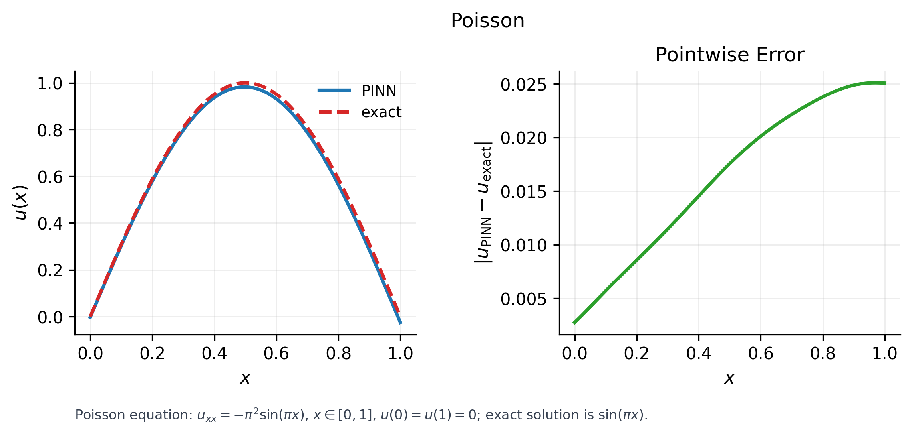
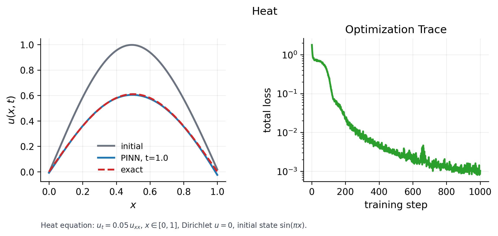
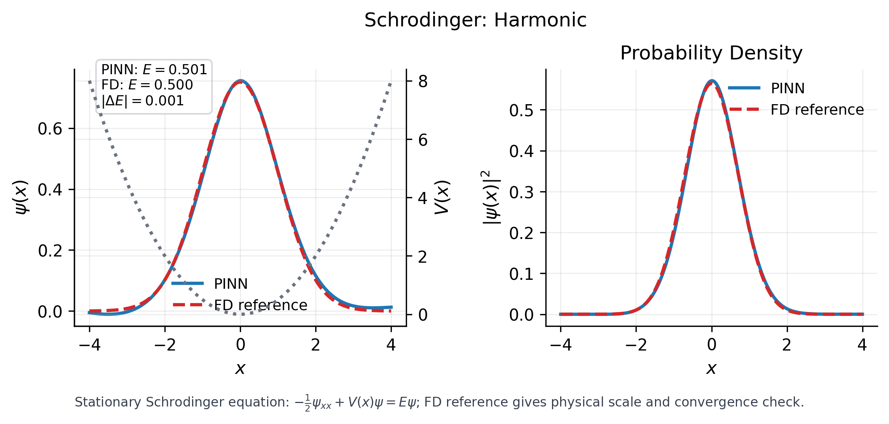

# PINN PDE

A compact PyTorch toolkit for building physics-informed neural network experiments for partial differential equations.

## Features

- Small generic core for neural models, autograd derivatives, PDE residual losses, and training loops
- Equation-specific code kept in examples instead of the package API
- Lightweight examples for 1D Schrodinger and viscous Burgers equations
- Minimal test suite for import, differentiation, training, and example smoke checks

## Install

```bash
pip install -e ".[dev]"
```

## Quick Start

```python
import torch
from pinn_pde import MLP, PDEProblem, ResidualLoss, CompositeLoss, Trainer, laplacian
from pinn_pde.training import sample_grid_1d

def poisson(points, model):
    u = model(points)
    return laplacian(u, points) + torch.sin(torch.pi * points)

model = MLP(input_dim=1, hidden_layers=(32, 32))
problem = PDEProblem(residual=poisson)
loss = CompositeLoss({"residual": ResidualLoss(problem)})

trainer = Trainer(
    model=model,
    loss_fn=loss,
    batch_fn=lambda: {"residual": sample_grid_1d((0.0, 1.0), 64)},
)
trainer.fit(steps=100)
```

## Layout

```text
src/pinn_pde/     generic PINN models, operators, losses, and training
examples/         concrete PDE cases such as Schrodinger and Burgers
tests/            lightweight correctness and smoke tests
```

## Canonical Figures

These examples show how a PINN uses neural-network derivatives to satisfy a PDE residual plus boundary/initial constraints.

### Poisson: residual learning with a known answer



The case solves $u_{xx}=-\pi^2\sin(\pi x)$ on $x\in[0,1]$ with $u(0)=u(1)=0$. The left panel compares the PINN solution with the exact solution $u(x)=\sin(\pi x)$; the right panel shows pointwise error.

### Heat: time-dependent diffusion



The case solves $u_t=\nu u_{xx}$ with $\nu=0.05$ and initial condition $u(x,0)=\sin(\pi x)$. The solution should decay smoothly; the right panel shows whether the PINN loss converges.

### Schrodinger: eigenstate with physical reference



The case solves the stationary Schrodinger eigenproblem $-\frac{1}{2}\psi_{xx}+V(x)\psi=E\psi$ for the harmonic potential $V(x)=\frac{1}{2}x^2$. The figure compares $\psi(x)$, $|\psi(x)|^2$, and $E$ against a finite-difference reference.

## Run Examples

```bash
python examples/schrodinger_1d.py
python examples/burgers_1d.py
python examples/canonical_cases.py poisson --steps 500
python examples/canonical_cases.py heat --steps 500
python examples/canonical_cases.py advection_diffusion --steps 500
python examples/canonical_cases.py schrodinger --potential double_well --steps 500
```

Generated figures are saved under `outputs/`, which is ignored by Git. Use `--formats png pdf svg` to choose formats. For report use, increase `--steps`, keep `--seed` fixed, and verify error/loss/reference diagnostics.

## Tests

```bash
pytest
```

## Adding A PDE

Define the residual in an example file, construct a `PDEProblem`, attach residual, boundary, or initial losses, and train with `Trainer`. Keep reusable mechanics in `src/pinn_pde`; keep equation constants, potentials, initial data, and plots in `examples`.
